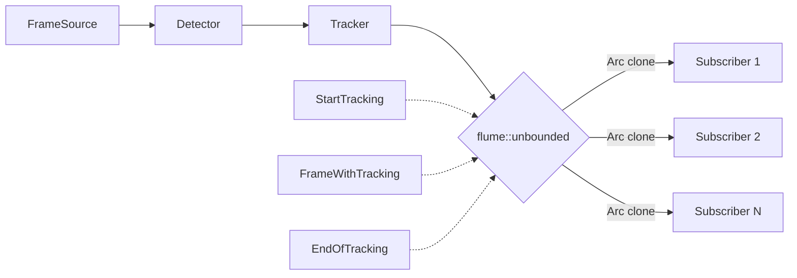
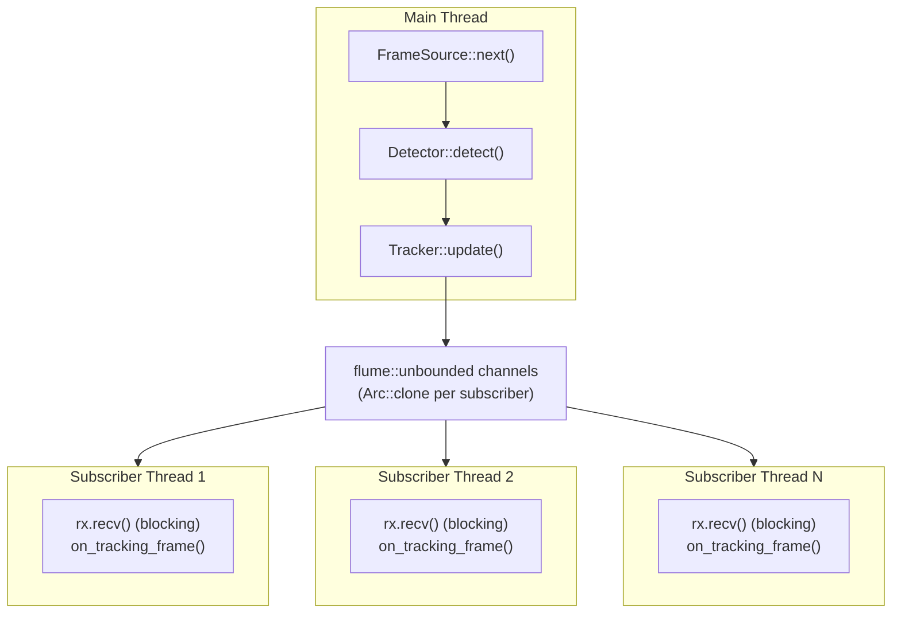

# Afora VC — Vehicle Counting & Tracking Analytics

Afora VC is a **vision-based object tracking and analytics engine** built in Rust. It processes video/image streams through a pipeline of detection, tracking, and analytics — all **decoupled via ports & adapters**, **orchestrated by a pipeline**, and **broadcast to pluggable subscribers** for post-processing.

---

## Architecture Overview

```mermaid
flowchart TD
    subgraph PIPELINE["Pipeline Orchestrator (single thread)"]
        direction LR
        FS[FrameSource<br/>(Iterator)] --> DET[Detector]
        DET --> TRK[Tracker<br/>(OC-SORT)]
        TRK --> BC[EventBroadcaster<br/>(flume channels)]
    end

    subgraph SUB["Subscriber Threads (one per subscriber)"]
        direction LR
        BC -. "Arc&lt;TrackingSubscriberInput&gt;" .-> L[LoggerSubscriber<br/>(stdout)]
        BC -. "Arc&lt;TrackingSubscriberInput&gt;" .-> VW[VideoWriterSubscriber<br/>(FFmpeg H.264)]
        BC -. "Arc&lt;TrackingSubscriberInput&gt;" .-> FUT1[AnalyticsSub A<br/>(turn grouping)]
        BC -. "Arc&lt;TrackingSubscriberInput&gt;" .-> FUT2[AnalyticsSub B<br/>(type count)]
    end
```

### Event Protocol



---

## Clean / Hexagonal Architecture

The codebase is organized in layers following **Screaming Architecture** — the folder structure tells you what the application does.

### Layer Map

```
src/
├── main.rs                          # Entry point — wires everything via PipelineBuilder
├── core/                            # Shared infrastructure
│   └── afora_error.rs               # Error types (domains AforaError)
├── shared/                          # Reusable domain across features
│   ├── domain/frame.rs              # Core domain: Frame (the fundamental data unit)
│   ├── domain/overlay.rs            # Shared utilities for drawing bounding boxes
│   └── utilities/
│       ├── get_video_props.rs       # Reads video metadata (fps, dimensions)
│       └── letterbox_transform.rs   # Letterbox resize for model input
├── features/                        # Business features
│   ├── detector/                    # Object detection
│   ├── tracker/                     # Object tracking with identities
│   ├── media_source/                # Frame providers (video, image)
│   ├── pipeline/                    # Orchestrator
│   ├── tracking_suscribers/         # Analytics consumers (Observer pattern)
│   └── writter/                     # Output writers (video, image)
```

### Feature Internal Structure (Hexagonal)

Every feature follows the same internal layout, enforcing **dependency inversion**:

```
feature/
├── domain/          # Enterprise business rules, pure data structures
│   ├── mod.rs
│   └── ...
├── ports/           # Interfaces (traits) — what the feature needs/offers
│   ├── mod.rs
│   └── ...
├── adapters/        # Concrete implementations of ports
│   ├── mod.rs
│   └── ...
├── application/     # Use cases / service orchestration (optional)
│   └── ...
└── <feature>_factory.rs  # Factory to assemble the feature (optional)
```

---

## Components in Detail

### 1. MediaSource — Frame Production

**Port**: [`FrameSource`](src/features/media_source/domain/frame_source.rs)

```rust
pub trait FrameSource: Iterator<Item = Result<Frame, AforaError>> {}
```

A **blanket implementation** — any `Iterator` yielding `Result<Frame, AforaError>` is a `FrameSource`. Zero-cost abstraction with zero boilerplate.

**Adapters**:
| Adapter | Source | Behavior |
|---------|--------|----------|
| `VideoSource` | Video file (FFmpeg) | Decodes frames on demand, supports `max_frames` limit |
| `ImageSource` | Image file | Yields a single frame |

**Factory**: `MediaSourceFactory::build(MediaSourceChoice)` dispatches to the right adapter.

---

### 2. Detector — Object Detection

Uses a **Bridge pattern** to separate hardware (inference runtime) from algorithm (model pipeline):

```mermaid
flowchart TD
    DET[Detector<br/>(orchestrator)]
    MP[ModelPipeline<br/>(algorithm)]
    IR[InferenceRuntime<br/>(hardware)]

    DET --> MP
    DET --> IR

    MP -. "preprocess / postprocess" .-> DET
    IR -. "run / input_spec" .-> DET
```

**Ports**:
- [`ModelPipeline`](src/features/detector/ports/model_pipeline.rs) — `preprocess(Frame) → TensorInput`, `postprocess(TensorOutput) → Vec<Detection>`. Pure algorithm, knows nothing about hardware.
- [`InferenceRuntime`](src/features/detector/ports/inference_runtime.rs) — `run(TensorInput) → TensorOutput`. Pure hardware, knows nothing about the model architecture.

**Validation**: On construction, `Detector::new()` validates that the shape expected by the `ModelPipeline` matches the shape provided by the `InferenceRuntime`, preventing silent shape mismatches.

**Adapters**:
| ModelPipeline | Hardware | Description |
|---|---|---|
| `YoloOnnxPipeline` | `OnnxRuntime` | YOLOv8/YOLO11 baseline implementation |
| `YoloOnnxOptimizedPipeline` | `OnnxRuntime` | **Recommended** — SIMD preprocessing, thread-local buffers, LUT normalization |

---

### 3. Tracker — Object Identity

**Port**: [`Tracker`](src/features/tracker/ports/tracker.rs)

```rust
pub trait Tracker {
    fn update(&mut self, input: TrackingInput) -> Result<Vec<TrackingOutput>, AforaError>;
}
```

**Adapters**:
| Adapter | Algorithm | Crate |
|---|---|---|
| `OcSortTracker` | OC-SORT | `trackforge` (0.3.0) |

`TrackingOutput` extends `Detection` with a persistent `id: u64` — the same object gets the same ID across frames.

---

### 4. Pipeline — Orchestrator

**Port**: [`Pipeline`](src/features/pipeline/ports/pipeline.rs)

```rust
pub trait Pipeline {
    fn run(&mut self) -> Result<(), AforaError>;
}
```

The orchestrator runs the detection→tracking loop and broadcasts results.

**Adapters**:
| Adapter | Execution | Description |
|---|---|---|
| `SequentialPipeline` | **Single thread** | Source → detect → track → broadcast, frame by frame. Current production implementation. |
| `MultithreadedPipeline` | **Stub** | Future: parallel source/detect/track with channels. |

#### SequentialPipeline Lifecycle

```mermaid
flowchart TD
    START([Pipeline::run]) --> NOTIFY1[notify StartTracking]
    NOTIFY1 --> LOOP{FrameSource::next}

    LOOP --> |Some(frame)| DET[Detector::detect]
    DET --> TRK[Tracker::update]
    TRK --> BUILD[build FrameTrackingProps]
    BUILD --> NOTIFY2[notify FrameWithTracking]
    NOTIFY2 --> LOOP

    LOOP --> |None| NOTIFY3[notify EndOfTracking]
    NOTIFY3 --> SHUTDOWN[close channels & join subscriber threads]
    SHUTDOWN --> DONE([return Ok])
```

#### Builder Pattern

The [`PipelineBuilder`](src/features/pipeline/pipeline_builder.rs) uses a **fluent builder API** with `take()` semantics — each component is consumed exactly once at `build()` time, enforcing correct assembly at compile time:

```rust
PipelineBuilder::new()
    .set_execution_mode(ExecutionMode::Sequential)
    .set_media_source(MediaSourceChoice::Video { path, max_frames })?
    .set_model(ModelChoice::YoloOnnx { conf_threshold: 0.25 })
    .set_runtime(RuntimeChoice::Onnx { model_path, num_threads: 4 })
    .set_tracker_config(TrackerChoice::OcSort { .. })?
    .add_subscriber(..)              // can chain multiple
    .add_subscriber(..)
    .build()?;                      // consumes everything → Pipeline
```

---

### 5. Tracking Subscribers — Analytics Consumers (Observer)

**Port**: [`TrackingSubscriber`](src/features/tracking_suscribers/ports/tracking_subscriber.rs)

```rust
pub trait TrackingSubscriber: 'static {
    fn on_tracking_start(&mut self) -> Result<(), AforaError>;
    fn on_tracking_frame(&mut self, frame: Arc<FrameTrackingProps>) -> Result<(), AforaError>;
    fn on_tracking_finalized(&mut self) -> Result<(), AforaError>;
}
```

Each subscriber runs in **its own thread**, receiving events via `flume::unbounded` channels. The pipeline broadcasts by `Arc::clone`-ing the event and sending it to all subscribers.

**Adapters**:
| Adapter | Purpose |
|---|---|
| `LoggerSubscriber` | Prints track data to stdout (debug/demo) |
| `VideoWriterSubscriber` | Renders overlays + encodes to MP4 (H.264) via FFmpeg |
| *(Future)* | Turn grouping analytics, vehicle type classification, speed estimation, etc. |

---

### 6. Shared — Cross-cutting Models

**`Frame`** — the fundamental data unit:
```rust
pub struct Frame {
    pub width: u32,
    pub height: u32,
    pub data: Vec<u8>,   // RGB24, packed
}
```

**`TrackingSubscriberInput`** — the event protocol:
```rust
pub enum TrackingSubscriberInput {
    StartTracking,
    FrameWithTracking(Arc<FrameTrackingProps>),
    EndOfTracking,
}
```

---

## Threading Model



Key points:
- **Single-threaded pipeline** — frames are processed sequentially. No frame is skipped.
- **Subscribers are decoupled** — they run in their own threads, so slow subscribers don't block the pipeline.
- **Unbounded channels** — the pipeline never blocks on `send()`. Subscribers with backpressure must handle it internally.
- **Graceful shutdown** — the pipeline drops all `Sender`s after `EndOfTracking`, then `join()`s every subscriber thread to ensure `finish()` (mp4 trailer, etc.) completes before `run()` returns.

---

## Factory / Assembly Diagram

```mermaid
flowchart TD
    PB[PipelineBuilder] --> MSF[MediaSourceFactory]
    PB --> DF[DetectorFactory]
    PB --> TF[TrackerFactory]

    MSF --> VS[VideoSource]
    MSF --> IS[ImageSource]

    DF --> DET[Detector]
    DET --> MP[ModelPipeline<br/>(YoloOnnx)]
    DET --> IR[InferenceRuntime<br/>(OnnxRuntime)]

    TF --> OCT[OcSortTracker]

    PB --> TSF[TrackerSubscriberFactory]
    TSF --> LS[LoggerSubscriber]
    TSF --> VWS[VideoWriterSubscriber]
    VWS --> VW[VideoWriter<br/>(FFmpeg)]
```

---

## Error Handling

All errors flow through a single domain enum:

```rust
pub enum AforaError {
    ModelLoadError(String),        // Model file issues
    RuntimeLoadError(String),      // Runtime/backend issues
    PreprocessError(String),       // Frame preprocessing
    InferenceError(String),        // Model inference
    PostprocessError(String),      // Output decoding
    MediaError(String),            // FFmpeg media operations
    InvalidArgument(String),       // CLI/user errors
    ConfigurationError(String),    // Pipeline assembly errors
    ShapeMismatch { expected: (u32, u32, u32), actual: Vec<i64> },  // Tensor shape mismatch
}
```

The `?` operator propagates errors naturally through the pipeline, with descriptive messages at each boundary.

---

## Dependencies

| Crate | Version | Role |
|---|---|---|
| `ort` | 2.0.0-rc.10 | ONNX Runtime bindings (CUDA support) |
| `ffmpeg-next` | 8.1.0 | Video decoding & encoding |
| `trackforge` | 0.3.0 | OC-SORT tracking algorithm |
| `flume` | 0.12.0 | MPSC channels for subscriber threads |
| `image` | 0.25.10 | Image manipulation |
| `imageproc` | 0.25 | Drawing overlays (bboxes, text) |
| `ab_glyph` | 0.2.32 | TrueType font rendering |
| `fast_image_resize` | 6 | SIMD-accelerated image resize (AVX2/SSE4.1) |
| `rayon` | 1 | Data parallelism for batch preprocessing |

---

## Getting Started

```bash
# Build (IMPORTANT: always use --release for production)
cargo build --release

# Run
cargo run --release -- \
    --source assets/videos/video.mp4 \
    --model assets/models/yolo11s.onnx \
    --max_frames 150 \
    --video_output_path output.mp4 \
    --batch_size 1

# Run with debug profiling (generates stacktrace.csv)
cargo run --release -- \
    --source assets/videos/video.mp4 \
    --model assets/models/yolo11s.onnx \
    --max_frames 10 \
    --video_output_path output.mp4 \
    --batch_size 1 \
    --debug
```

> ⚠️ **CRITICAL**: Always use `--release` flag. Debug builds are ~100x slower due to missing SIMD optimizations.

---

## Preprocessing Pipeline

The preprocessing stage transforms raw video frames into tensors suitable for YOLO inference. This is a critical performance bottleneck that has been heavily optimized.

### Architecture

```
Frame (2560x1440 RGB) 
    │
    ▼
┌─────────────────────────────────────────────────────────┐
│  PreprocessingEngine                                    │
│  ├── thread_local ScratchContext (per Rayon thread)    │
│  │   ├── Resizer (reused, expensive to create)         │
│  │   └── dst_image buffer (reused across frames)       │
│  │                                                      │
│  └── Processing steps:                                  │
│      1. ImageRef::new() — zero-copy reference          │
│      2. SIMD resize (AVX2/SSE4.1) via fast_image_resize│
│      3. Letterbox padding (aspect ratio preservation)  │
│      4. Pack to tensor format (NCHW/NHWC)              │
│      5. Normalize via LUT (no divisions)               │
└─────────────────────────────────────────────────────────┘
    │
    ▼
TensorInput (1x3x640x640 F32, ~4.9MB)
```

### Key Optimizations

| Optimization | Before | After | Impact |
|--------------|--------|-------|--------|
| **SIMD resize** | ~300ms | ~2ms | AVX2/SSE4.1 acceleration via `fast_image_resize` |
| **Zero-copy ImageRef** | Copy 11MB | Reference | Eliminates frame copy before resize |
| **Thread-local scratch** | Alloc per frame | Reuse buffers | No allocations in hot path |
| **LUT normalization** | `pixel / 255.0` | `LUT[pixel]` | Division-free normalization |
| **Direct tensor write** | Intermediate buffer | Write to final | Single pass, no temp allocations |

### Performance Results

| Stage | Debug Build | Release Build |
|-------|-------------|---------------|
| Preprocessing | 300-400ms | **3-4ms** |
| Inference (GPU) | ~200ms | ~85-100ms |
| Postprocessing | ~25ms | ~1-2ms |
| **Total/frame** | ~600ms | **~90-110ms** |

### System Requirements for SIMD

The preprocessing relies on CPU SIMD instructions. Verify your CPU supports them:

```bash
# Check CPU features
cat /proc/cpuinfo | grep -E "avx2|sse4"

# Expected output should include:
# flags: ... sse4_1 sse4_2 ... avx avx2 ...
```

The `fast_image_resize` library auto-detects and uses the best available:
- **AVX2** (preferred) — 256-bit SIMD, ~8 pixels/instruction
- **SSE4.1** (fallback) — 128-bit SIMD, ~4 pixels/instruction
- **None** — Scalar fallback (very slow)

### Supported Tensor Formats

The preprocessing engine supports multiple output formats based on `TensorSpec`:

| Layout | DType | Use Case |
|--------|-------|----------|
| NCHW | F32 | Standard YOLO (default) |
| NCHW | U8 | Quantized models |
| NCHW | I8 | INT8 quantized models |
| NHWC | U8 | TFLite-style models |
| NHWC | I8 | TFLite INT8 models |

### Module Structure

```
src/features/detector/adapters/model_adapters/yolo_onnx_pipeline/
├── mod.rs                      # Module exports
├── pipeline.rs                 # YoloOnnxOptimizedPipeline (implements ModelPipeline)
├── postprocessing.rs           # NMS and bbox decoding
└── preprocessing/
    ├── mod.rs                  # Exports PreprocessingEngine
    ├── engine.rs               # Orchestrator with Rayon parallelism
    ├── scratch.rs              # ScratchContext with specialized pack functions
    └── lut.rs                  # NORM_F32_LUT and padding constants
```

### Troubleshooting Performance

If preprocessing is slow (>10ms per frame):

1. **Verify release build**: `cargo run --release -- ...`
   - Debug builds disable SIMD and are ~100x slower
   
2. **Check SIMD detection**: Add this temporarily to verify:
   ```rust
   eprintln!("CPU extensions: {:?}", resizer.cpu_extensions());
   ```
   Should print `Avx2` or `Sse4_1`, NOT `None`

3. **Check frame dimensions**: Larger frames = longer resize
   - 1920x1080 → 640x640: ~1-2ms
   - 2560x1440 → 640x640: ~2-3ms
   - 3840x2160 → 640x640: ~4-6ms

4. **Profile with stacktrace**: Run with `--debug` flag, then analyze `stacktrace.csv`:
   ```bash
   cat stacktrace.csv | grep "resize_simd\|detection_preprocessing"
   ```

---

## Extension Points

Adding a **new analytics subscriber** (e.g., vehicle turn classifier):

```rust
struct TurnClassifier { .. }

impl TrackingSubscriber for TurnClassifier {
    fn on_tracking_frame(&mut self, frame: Arc<FrameTrackingProps>) -> Result<(), AforaError> {
        // Group vehicles by track trajectory
        Ok(())
    }
}

// Then register in main.rs:
.add_subscriber(TrackerSubscriberChoice::TurnClassifier { .. })
```

Adding a **new inference backend** (e.g., RKNN):

- Implement `InferenceRuntime` for the hardware
- Add the corresponding `ModelPipeline` variant (or reuse existing one)
- Add the new variant to `RuntimeChoice` and `ModelChoice`
- The detector validates shape compatibility automatically

---

## TODO

- [x] ~~Investigate subscriber shutdown to finalize video writing~~ *(Fixed: shutdown_subscribers() joins threads)*
- [ ] Implement `MultithreadedPipeline` with parallel detect/track
- [ ] Add real analytics subscribers (turn grouping, type classification, speed estimation)
- [ ] CLI argument parsing via `clap`
